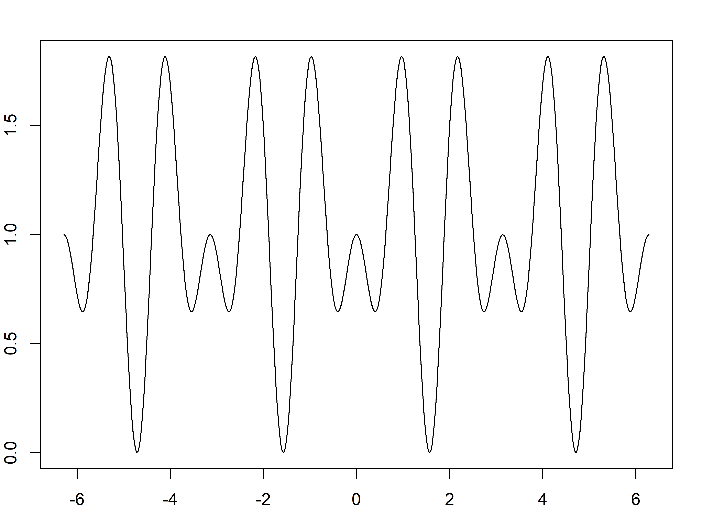

<!-- README.md is generated from README.Rmd. Please edit that file -->

# latex2r

The goal of latex2r is to translate latex formulas to R code.

THE PACKAGE IS UNDER VERY EARLY DEVELOPMENT, DO NOT USE\!

## Installation

You can install the development version from
[GitHub](https://github.com/) with:

``` r
# install.packages("devtools")
devtools::install_github("tomicapretto/latex2r")
```

## Example

``` r
library(latex2r)
latex2r("\\beta_1^{\\frac{x+1}{x^2 \\cdot y}}")
#> [1] "beta_1^((x + 1) / (x^2 * y))"
```

For those who dare to go a little further

``` r
eval(parse(text = latex2r::latex2r("\\tanh(x_1 ^ 2)")), envir = list(x_1 = 2))
#> [1] 0.9993293
```

For those who are crazy enough to navigate the deepest waters of R

NB: The following is very experimental, but shows the power of what you
can do with this package (and with R).

``` r

# Obtain the AST of an R expression (or something like that).
get_ast = function(arg) purrr::map_if(as.list(arg), is.call, get_ast)

# If exists, get the object. Otherwise, return NULL.
get2 = function(x) {
  if (exists(x)) return(get(x))
  return(NULL)
}

# Heuristic to determine the arguments of a function.
get_args = function(x) {
  if (is.symbol(x) && !is.function(get2(as.character(x)))) {
    as.character(x)
  } else {
    NA
  }
}

# Create a function of given args and given body (both are strings).
new_function = function(args, body) {
  f = function() {}
  args = setNames(rep(list(bquote()), length(args)), args) 
  formals(f) = args
  body(f) = parse(text = body)
  environment(f) = parent.frame()
  return(f)
}

# Given a latex string, parse, construct an R function and return it.
generate_function = function(latex_string) {
  fun_body = latex2r(latex_string)
  fun_body_expr = parse(text = fun_body)
  body_ast = unlist(get_ast(fun_body_expr))
  
  fun_args = sapply(body_ast, get_args)
  fun_args = sort(unique(fun_args[!is.na(fun_args)]))
  
  new_function(fun_args, fun_body)

}

latex_string = "\\sin{x * a}"
x = seq(-2*pi, 2*pi, length.out = 500)

f = generate_function(latex_string)
f_x = f(x = x, a = 2)
plot(x, f_x, type = "l")

latex_string = "\\cos{x * b}"
f = generate_function(latex_string)
f_x = f(x = x, b = 4)
lines(x, f_x, col = "red")
```



<!-- I can't use `c` because it is a function. I must improve the implementation here. -->
